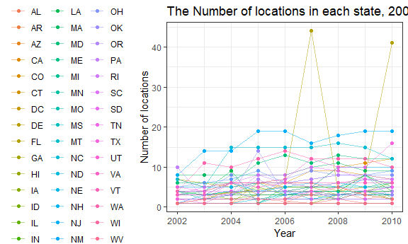
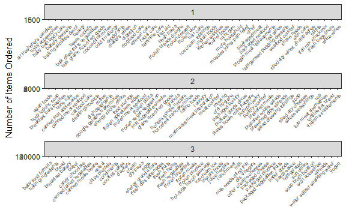

p8105\_hw3\_bg2604
================
Boya Guo
10/15/2018

### Problem 1

``` r
devtools::install_github("p8105/p8105.datasets")
```

    ## Skipping install of 'p8105.datasets' from a github remote, the SHA1 (21f5ad1c) has not changed since last install.
    ##   Use `force = TRUE` to force installation

``` r
library(p8105.datasets)
p1_brfss=brfss_smart2010 %>%
  janitor::clean_names() %>%
  separate(locationdesc, into = c("state", "county"), sep = " - ") %>%
  filter(topic == 'Overall Health') %>%
  mutate(response = as.factor(response),
         response = factor(response, levels = c("Excellent", "Very good", "Good", "Fair", "Poor"))) %>%
  select(-locationabbr, year, state, county, response, everything())
```

#### Problem 1.1 In 2002, which states were observed at 7 locations?

``` r
p1_brfss %>%
  filter(year == 2002) %>% 
  group_by(year, state) %>% 
  summarize(count = n_distinct(county)) %>% 
  filter(count == 7)
```

    ## # A tibble: 3 x 3
    ## # Groups:   year [1]
    ##    year state count
    ##   <int> <chr> <int>
    ## 1  2002 CT        7
    ## 2  2002 FL        7
    ## 3  2002 NC        7

Answer: According to the R output, CT, FL and NC states were observed at 7 locations.

#### Problem 1.2 Make a “spaghetti plot” that shows the number of locations in each state from 2002 to 2010.

``` r
p1_brfss %>% 
  group_by(year, state) %>% 
  summarize(count = n_distinct(county)) %>% 
  ggplot(aes(x = year, y = count, color = state)) + 
  geom_point() + 
  geom_line(alpha = .5) + 
  labs( title = "Locations in each state, 2002-2010",
    x = "Year",
    y = "Number of locations"
    ) + 
  theme(legend.position = "left")
```



#### Problem 1.3 Make a table showing, for the years 2002, 2006, and 2010, the mean and standard deviation of the proportion of “Excellent” responses across locations in NY State.

``` r
brfss_p1.3 <- p1_brfss %>%
  spread(key = "response", value = "data_value") %>% 
  janitor::clean_names() %>%
  filter( year == 2002 | year == 2006 | year == 2010) %>%   
  filter(state == "NY") %>% 
  group_by(state, county) %>% 
  summarize(avg_excellent = mean(excellent, na.rm = TRUE),sd_excellent = sd(excellent, na.rm = TRUE)) %>% 
  knitr::kable(digits = 1)

brfss_p1.3
```

| state | county             |  avg\_excellent|  sd\_excellent|
|:------|:-------------------|---------------:|--------------:|
| NY    | Bronx County       |            17.6|            NaN|
| NY    | Erie County        |            17.2|            NaN|
| NY    | Kings County       |            20.4|            1.8|
| NY    | Monroe County      |            22.4|            NaN|
| NY    | Nassau County      |            24.9|            2.8|
| NY    | New York County    |            27.5|            1.5|
| NY    | Queens County      |            19.6|            1.4|
| NY    | Suffolk County     |            24.1|            3.3|
| NY    | Westchester County |            26.4|            0.6|

#### Problem 1.4 For each year and state, compute the average proportion in each response category (taking the average across locations in a state). Make a five-panel plot that shows, for each response category separately, the distribution of these state-level averages over time.

``` r
p1_brfss %>% 
  spread(key = "response", value = "data_value") %>% 
  janitor::clean_names() %>% 
  select(year, state, county, excellent:poor) %>% 
  group_by(year, state) %>% 
  summarize(mean_excellent = mean(excellent, na.rm = TRUE),
            mean_very_good = mean(very_good, na.rm = TRUE),
            mean_good = mean(good, na.rm = TRUE),
            mean_fair = mean(fair, na.rm = TRUE),
            mean_poor = mean(poor, na.rm = TRUE)
            ) %>% 
  gather(key = "mean_response", value = "average_proportion",    
  mean_excellent:mean_poor) %>%
  mutate(mean_response = as.factor(mean_response),
  mean_response = factor(mean_response, levels = c("mean_excellent", "mean_very_good", "mean_good", "mean_fair", "mean_poor"))) %>% 
  ggplot(aes(x = year, y = average_proportion, color = state)) + 
  geom_point() + geom_line() +
  facet_grid(~mean_response) +
  labs(
    title = "Average proportion in each overall health response for years and states",
    x = "Year",
    y = "Average proportion"
  ) + theme(legend.position = "none",axis.text.x = element_text(angle = 45))
```


### Problem 2

Write a short description of the dataset, noting the size and structure of the data, describing some key variables, and giving illstrative examples of observations.

#### Problem 2.1 How many aisles are there, and which aisles are the most items ordered from?

``` r
instacart %>% 
  group_by(aisle) %>% 
  summarize(n_item = n()) %>% 
  arrange(desc(n_item))
```

    ## # A tibble: 134 x 2
    ##    aisle                         n_item
    ##    <chr>                          <int>
    ##  1 fresh vegetables              150609
    ##  2 fresh fruits                  150473
    ##  3 packaged vegetables fruits     78493
    ##  4 yogurt                         55240
    ##  5 packaged cheese                41699
    ##  6 water seltzer sparkling water  36617
    ##  7 milk                           32644
    ##  8 chips pretzels                 31269
    ##  9 soy lactosefree                26240
    ## 10 bread                          23635
    ## # ... with 124 more rows

Answer: There are 134 aisles in the dataset. The fresh vegtables, frresh fruits, packaged vegetables fruits are the top three aisles with the most items ordered.

#### Problem 2.2 Make a plot that shows the number of items ordered in each aisle. Order aisles sensibly, and organize your plot so others can read it.

``` r
instacart_p2.2 <- instacart %>% 
  group_by(aisle) %>% 
  summarize(item_count = n()) %>% 
  mutate(group = as.numeric(cut_number(item_count, 3))) %>% 
  ggplot(aes(x = aisle, y = item_count)) +
    geom_point() +
    facet_wrap(group ~ ., nrow = 3, scales = "free") +
    theme(axis.text.x = element_text(size = 6, hjust = 1, angle = 50)) +
    labs(
      title = "Number of items ordered in aisles",
      x = "Aisle Name",
      y = "Number of Items Ordered"
      )
instacart_p2.2
```



#### Problem 2.3 Make a table showing the most popular item in each of the aisles “baking ingredients”, “dog food care”, and “packaged vegetables fruits”.

``` r
instacart %>%  
  filter(aisle == "baking ingredients" | aisle == "dog food care" | aisle == "packaged vegetables fruits") %>% 
  group_by(aisle, product_name) %>% 
  summarize(count = n()) %>% 
  group_by(aisle) %>% 
  mutate(rank = min_rank(desc(count))) %>%  
  filter(rank < 2)
```

    ## # A tibble: 3 x 4
    ## # Groups:   aisle [3]
    ##   aisle                  product_name                          count  rank
    ##   <chr>                  <chr>                                 <int> <int>
    ## 1 baking ingredients     Light Brown Sugar                       499     1
    ## 2 dog food care          Snack Sticks Chicken & Rice Recipe D~    30     1
    ## 3 packaged vegetables f~ Organic Baby Spinach                   9784     1

Answer: The most popular items in baking ingredients, dog food care, and packaged vegetables fruits are Light Brown Suger, Snack Sticks Chicken & Rice Recipe Dog Treats, and Organic Baby Spinach, respectively.
