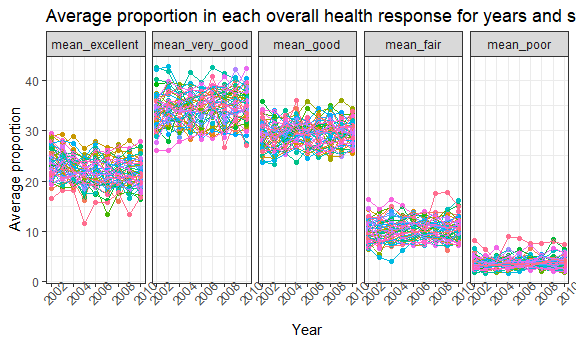

p8105\_hw3\_bg2604
================
Boya Guo
10/15/2018

### Problem 1

``` r
devtools::install_github("p8105/p8105.datasets")
```

    ## Skipping install of 'p8105.datasets' from a github remote, the SHA1 (21f5ad1c) has not changed since last install.
    ##   Use `force = TRUE` to force installation

``` r
library(p8105.datasets)
p1_brfss=brfss_smart2010 %>%
  janitor::clean_names() %>%
  separate(locationdesc, into = c("state", "county"), sep = " - ") %>%
  filter(topic == 'Overall Health') %>%
  mutate(response = as.factor(response),
         response = factor(response, levels = c("Excellent", "Very good", "Good", "Fair", "Poor"))) %>%
  select(-locationabbr, year, state, county, response, everything())
```

Answer: The names of variables are cleaned. Locationdesc is seperated into state and county, and Locationdesc is not selected in the final dataset. We then filtered only Overal Health topic and ordered responses from Excellent to Poor.

#### Problem 1.1 In 2002, which states were observed at 7 locations?

``` r
p1_brfss %>%
  filter(year == 2002) %>% 
  group_by(year, state) %>% 
  summarize(count = n_distinct(county)) %>% 
  filter(count == 7)
```

    ## # A tibble: 3 x 3
    ## # Groups:   year [1]
    ##    year state count
    ##   <int> <chr> <int>
    ## 1  2002 CT        7
    ## 2  2002 FL        7
    ## 3  2002 NC        7

Answer: According to the R output, CT, FL and NC states were observed at 7 locations.

#### Problem 1.2 Make a “spaghetti plot” that shows the number of locations in each state from 2002 to 2010.

``` r
p1_brfss %>% 
  group_by(year, state) %>% 
  summarize(count = n_distinct(county)) %>% 
  ggplot(aes(x = year, y = count, color = state)) + 
  geom_point() + 
  geom_line(alpha = .5) + 
  labs( title = "The Number of locations in each state, 2002-2010",
    x = "Year",
    y = "Number of locations"
    ) + 
  theme(legend.position = "left")
```

 Answer: We created a "spaghetti plot" shows the number of locations in each state from 2002 to 2010. From graph, we could see that for most states, the number of locations is below 20. However, Florida has two peak value above 40, one in 2007 and another in 2010.

#### Problem 1.3 Make a table showing, for the years 2002, 2006, and 2010, the mean and standard deviation of the proportion of “Excellent” responses across locations in NY State.

``` r
brfss_p1.3 <- p1_brfss %>%
  spread(key = "response", value = "data_value") %>% 
  janitor::clean_names() %>%
  filter( year == 2002 | year == 2006 | year == 2010) %>%   
  filter(state == "NY") %>% 
  group_by(state, county) %>% 
  summarize(avg_excellent = mean(excellent, na.rm = TRUE),sd_excellent = sd(excellent, na.rm = TRUE)) %>% 
  knitr::kable(digits = 1)

brfss_p1.3
```

| state   | county                |    avg\_excellent|                                                                                                                                                                                            sd\_excellent|
|:--------|:----------------------|-----------------:|--------------------------------------------------------------------------------------------------------------------------------------------------------------------------------------------------------:|
| NY      | Bronx County          |              17.6|                                                                                                                                                                                                      NaN|
| NY      | Erie County           |              17.2|                                                                                                                                                                                                      NaN|
| NY      | Kings County          |              20.4|                                                                                                                                                                                                      1.8|
| NY      | Monroe County         |              22.4|                                                                                                                                                                                                      NaN|
| NY      | Nassau County         |              24.9|                                                                                                                                                                                                      2.8|
| NY      | New York County       |              27.5|                                                                                                                                                                                                      1.5|
| NY      | Queens County         |              19.6|                                                                                                                                                                                                      1.4|
| NY      | Suffolk County        |              24.1|                                                                                                                                                                                                      3.3|
| NY      | Westchester County    |              26.4|                                                                                                                                                                                                      0.6|
| Answer: | The mean of the propo |  rtion of "Excell|  ent" responses is the highest in New York County, and the lowest in Erie County. The standard deviation ranges from 0.6 to 2.8. Bronx, Erie and Monroe counties have NA values from standard deviation.|

#### Problem 1.4 For each year and state, compute the average proportion in each response category (taking the average across locations in a state). Make a five-panel plot that shows, for each response category separately, the distribution of these state-level averages over time.

``` r
p1_brfss %>% 
  spread(key = "response", value = "data_value") %>% 
  janitor::clean_names() %>% 
  select(year, state, county, excellent:poor) %>% 
  group_by(year, state) %>% 
  summarize(mean_excellent = mean(excellent, na.rm = TRUE),
            mean_very_good = mean(very_good, na.rm = TRUE),
            mean_good = mean(good, na.rm = TRUE),
            mean_fair = mean(fair, na.rm = TRUE),
            mean_poor = mean(poor, na.rm = TRUE)
            ) %>% 
  gather(key = "mean_response", value = "average_proportion",    
  mean_excellent:mean_poor) %>%
  mutate(mean_response = as.factor(mean_response),
  mean_response = factor(mean_response, levels = c("mean_excellent", "mean_very_good", "mean_good", "mean_fair", "mean_poor"))) %>% 
  ggplot(aes(x = year, y = average_proportion, color = state)) + 
  geom_point() + geom_line() +
  facet_grid(~mean_response) +
  labs(
    title = "Average proportion in each overall health response for years and states",
    x = "Year",
    y = "Average proportion"
  ) + theme(legend.position = "none",axis.text.x = element_text(angle = 45))
```

 Answer: Five-panel plot were created for earch response in each state across years. A similar trend was observed for each state for each response type from 2002 to 2010.

### Problem 2

#### Write a short description of the dataset, noting the size and structure of the data, describing some key variables, and giving illstrative examples of observations.

``` r
instacart
```

    ## # A tibble: 1,384,617 x 15
    ##    order_id product_id add_to_cart_ord~ reordered user_id eval_set
    ##       <int>      <int>            <int>     <int>   <int> <chr>   
    ##  1        1      49302                1         1  112108 train   
    ##  2        1      11109                2         1  112108 train   
    ##  3        1      10246                3         0  112108 train   
    ##  4        1      49683                4         0  112108 train   
    ##  5        1      43633                5         1  112108 train   
    ##  6        1      13176                6         0  112108 train   
    ##  7        1      47209                7         0  112108 train   
    ##  8        1      22035                8         1  112108 train   
    ##  9       36      39612                1         0   79431 train   
    ## 10       36      19660                2         1   79431 train   
    ## # ... with 1,384,607 more rows, and 9 more variables: order_number <int>,
    ## #   order_dow <int>, order_hour_of_day <int>,
    ## #   days_since_prior_order <int>, product_name <chr>, aisle_id <int>,
    ## #   department_id <int>, aisle <chr>, department <chr>

``` r
sum(is.na(instacart))
```

    ## [1] 0

``` r
nrow(distinct(instacart, order_id))
```

    ## [1] 131209

``` r
nrow(distinct(instacart, user_id))
```

    ## [1] 131209

``` r
nrow(distinct(instacart, product_id))
```

    ## [1] 39123

Answer: This is a 1384617\*15 dataset without missing data. There are 131209 orders, 131209 users and 39123 products. The variables include information (id and name) of departments, aisles and products, and order information (eg. order id, number of order, order day).

#### Problem 2.1 How many aisles are there, and which aisles are the most items ordered from?

``` r
instacart %>% 
  group_by(aisle) %>% 
  summarize(n_item = n()) %>% 
  arrange(desc(n_item))
```

    ## # A tibble: 134 x 2
    ##    aisle                         n_item
    ##    <chr>                          <int>
    ##  1 fresh vegetables              150609
    ##  2 fresh fruits                  150473
    ##  3 packaged vegetables fruits     78493
    ##  4 yogurt                         55240
    ##  5 packaged cheese                41699
    ##  6 water seltzer sparkling water  36617
    ##  7 milk                           32644
    ##  8 chips pretzels                 31269
    ##  9 soy lactosefree                26240
    ## 10 bread                          23635
    ## # ... with 124 more rows

Answer: There are 134 aisles in the dataset. The fresh vegtables, fresh fruits, packaged vegetables fruits are the top three aisles with the most items ordered.

#### Problem 2.2 Make a plot that shows the number of items ordered in each aisle. Order aisles sensibly, and organize your plot so others can read it.

``` r
instacart_p2.2 <- instacart %>% 
  group_by(aisle) %>% 
  summarize(item_count = n()) %>% 
  mutate(group = as.numeric(cut_number(item_count, 3))) %>% 
  ggplot(aes(x = aisle, y = item_count)) +
    geom_point() +
    facet_wrap(group ~ ., nrow = 3, scales = "free") +
    theme(axis.text.x = element_text(size = 6, hjust = 1, angle = 45)) +
    labs(
      title = "Number of items ordered in aisles",
      x = "Aisle Name",
      y = "Number of Items Ordered"
      )
instacart_p2.2
```

 Answer: We dividied the plot into 3 parts to make it more clear for readers to view. Fresh vegetables and fresh fruits have largest numbers of items ordered in aisles. Beauty products have the lowest number of items ordered.

#### Problem 2.3 Make a table showing the most popular item in each of the aisles “baking ingredients”, “dog food care”, and “packaged vegetables fruits”.

``` r
instacart %>%  
  filter(aisle == "baking ingredients" | aisle == "dog food care" | aisle == "packaged vegetables fruits") %>% 
  group_by(aisle, product_name) %>% 
  summarize(count = n()) %>% 
  group_by(aisle) %>% 
  mutate(rank = min_rank(desc(count))) %>%  
  filter(rank < 2)
```

    ## # A tibble: 3 x 4
    ## # Groups:   aisle [3]
    ##   aisle                  product_name                          count  rank
    ##   <chr>                  <chr>                                 <int> <int>
    ## 1 baking ingredients     Light Brown Sugar                       499     1
    ## 2 dog food care          Snack Sticks Chicken & Rice Recipe D~    30     1
    ## 3 packaged vegetables f~ Organic Baby Spinach                   9784     1

Answer: The most popular items in baking ingredients, dog food care, and packaged vegetables fruits are Light Brown Suger, Snack Sticks Chicken & Rice Recipe Dog Treats, and Organic Baby Spinach, respectively.

#### Problem 2.4 Make a table showing the mean hour of the day at which Pink Lady Apples and Coffee Ice Cream are ordered on each day of the week; format this table for human readers (i.e. produce a 2 x 7 table).

``` r
instacart %>% 
  group_by(product_name, order_dow) %>% 
  summarize(mean_hour = (mean(order_hour_of_day)) ) %>% 
  filter(product_name %in% c("Pink Lady Apples", "Coffee Ice Cream")) %>% 
  spread(key = "product_name", value = "mean_hour") %>% 
  knitr::kable()
```

|    order\_dow|     Coffee Ice Cream|                                                                                                                                                                                                                                                                                              Pink Lady Apples|
|-------------:|--------------------:|-------------------------------------------------------------------------------------------------------------------------------------------------------------------------------------------------------------------------------------------------------------------------------------------------------------:|
|             0|             13.77419|                                                                                                                                                                                                                                                                                                      13.44118|
|             1|             14.31579|                                                                                                                                                                                                                                                                                                      11.36000|
|             2|             15.38095|                                                                                                                                                                                                                                                                                                      11.70213|
|             3|             15.31818|                                                                                                                                                                                                                                                                                                      14.25000|
|             4|             15.21739|                                                                                                                                                                                                                                                                                                      11.55172|
|             5|             12.26316|                                                                                                                                                                                                                                                                                                      12.78431|
|             6|             13.83333|                                                                                                                                                                                                                                                                                                      11.93750|
|  Answer: A ta|  ble showing the mea|  n hour of the day at which Pink Lady Apples and Coffee Ice Cream are ordered on each day of the week was created. 0 to 6 represents Sunday to Saturday in each week. The highest mean hour of the day at which Coffee Ice Cream are ordered is Tuesday (13.77), and Wednesday for Pinck Lady Apples (14.25).|

### Problem 3

#### Write a short description of the dataset, noting the size and structure of the data, describing some key variables, and indicating the extent to which missing data is an issue

``` r
ny_noaa %>% 
  group_by(id) %>% 
  summarize(prcp_na = sum(is.na(prcp)),
            snow_na = sum(is.na(snow)),
            snwd_na = sum(is.na(snwd)),
            tmax_na = sum(is.na(tmax)),
            tmin_na = sum(is.na(tmin)))
```

    ## # A tibble: 747 x 6
    ##    id          prcp_na snow_na snwd_na tmax_na tmin_na
    ##    <chr>         <int>   <int>   <int>   <int>   <int>
    ##  1 US1NYAB0001      60     252     874    1157    1157
    ##  2 US1NYAB0006      19     283     703     852     852
    ##  3 US1NYAB0010     220     352     816     822     822
    ##  4 US1NYAB0016      98     152     212     214     214
    ##  5 US1NYAB0017     301     415     459     459     459
    ##  6 US1NYAB0021       2      37      72     365     365
    ##  7 US1NYAB0022     233     238     239     273     273
    ##  8 US1NYAB0023     144     238     289     365     365
    ##  9 US1NYAB0025      40      43      43     215     215
    ## 10 US1NYAL0002      57     245     409     549     549
    ## # ... with 737 more rows

Answer: This is a 2595176\*7 dataset. The variables include NY weather station id, the date of observation, precipitation (mm), snowfall (mm), snow depth (mm), and the maximum and minimum temperatures (tenths of degrees C). Missing data could be a big problem becasue a large proportion of data is missing.

#### Problem 3.1 Do some data cleaning. Create separate variables for year, month, and day. Ensure observations for temperature, precipitation, and snowfall are given in reasonable units. For snowfall, what are the most commonly observed values? Why?

``` r
ny_noaa_3.1 <- ny_noaa %>% 
  separate(date, into = c("year", "month", "day"), sep = "-") %>% 
  mutate(prcp = prcp / 10,
         tmax = as.numeric(tmax) / 10,
         tmin = as.numeric(tmin) / 10)
  count(ny_noaa, snow) %>% arrange(desc(n))
```

    ## # A tibble: 282 x 2
    ##     snow       n
    ##    <int>   <int>
    ##  1     0 2008508
    ##  2    NA  381221
    ##  3    25   31022
    ##  4    13   23095
    ##  5    51   18274
    ##  6    76   10173
    ##  7     8    9962
    ##  8     5    9748
    ##  9    38    9197
    ## 10     3    8790
    ## # ... with 272 more rows

Answer: We seperated date into year, month and day, and then enxure reasonable units. The most commonly observed value is 0 for snowfall because we could have snowfall in winter. Therefore, snowdall is less frequent and most values is 0.

#### Problem 3.2 Make a two-panel plot showing the average max temperature in January and in July in each station across years. Is there any observable / interpretable structure? Any outliers?

``` r
ny_noaa_3.1 %>% 
  group_by(id, year, month) %>% 
  summarize(mean_tmax = round(mean(tmax, na.rm = TRUE), digits = 1),
            mean_tmin = round(mean(tmin, na.rm = TRUE), digits = 1)) %>% 
  na.omit() %>% 
  gather(key = mean_temp, value = temp, mean_tmax) %>%
  filter(month %in% c("01", "07")) %>% 
  ggplot(aes(x = year, y = temp)) + geom_boxplot() +   
  facet_grid(~month) + 
  theme(axis.text.x = element_text(size = 5, angle = 45),legend.position = "bottom") +
   labs(
    title = "Average max temperature in January and July in each station, 1981 to 2010", x = "Year", y = "Average max temperature in ˚C"
  )
```

 Answer: There is approximate same pattern for tmax across years. For tmax in January, the range of tmax is from -10 to 5 degree. For tmax in July, the tmax ranges from 25 to 30. Outliers: Jan 1982, an outlier below -10 degree; July 1987, an outlier below 15 degree.

#### Problem 3.3 Make a two-panel plot showing (i) tmax vs tmin for the full dataset (note that a scatterplot may not be the best option); and (ii) make a plot showing the distribution of snowfall values greater than 0 and less than 100 separately by year.

``` r
ny_noaa_3.3 <- ny_noaa_3.1 %>% 
  ggplot(aes(x = tmax, y = tmin)) + geom_hex()  +
  labs(
    title = "Hex plot of maximum temperature/minimum temperature",
    x = "maximum temperature",
    y = "minimum temperature"
  )
ny_noaa_3.3
```

    ## Warning: Removed 1136276 rows containing non-finite values (stat_binhex).


``` r
ny_noaa_3 <- ny_noaa_3.1 %>% 
  filter(snow > 0 & snow < 100) %>% 
  ggplot(aes(x = snow, y = year)) + geom_density_ridges(scale = 1) +
  labs(
    title = "Density plot of snowfall from 0 mm to 100 mm across years",
    x = "Snow Fall in mm", y = "Year")

ny_noaa_3
```

    ## Picking joint bandwidth of 3.76

 Answer: From the hexplot we can conclude that there is an linear relationship between tmax and tmin. The light blue indicates that there are more counts in the plot. From ridges plot of snowfall, we observe the same pattern of snowfall distribution across years.
